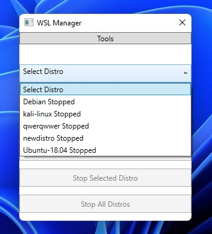
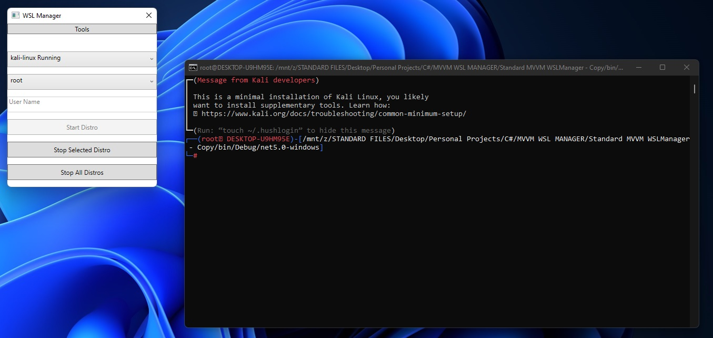
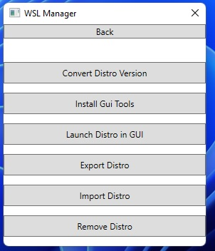
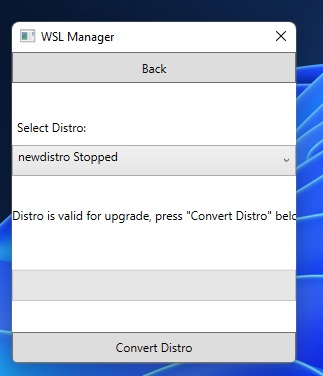
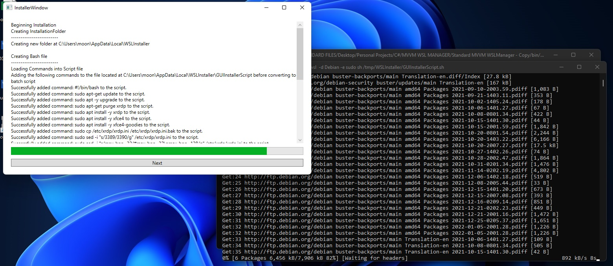
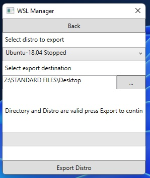
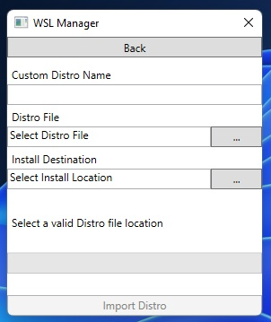

# WSL Manager

# Description

## Table Of Contents

* [Installation](#installation)
* [Usage](#usage)
* [Bugs](#bugs)
* [Upcoming Features](#upcoming Features)
* [Credits](#credits)
* [License](#license)

## Installation

To run this program visit this link [here]() or download the most recent release from github. Unzip the folder and run WSLManager.exe.

## Usage

### Main View

* Select how you wish to login, if you select default it will login as whoever the default user is. If you select User put the desired username in and select Start Selected Distro (note you will recive and error if the user does not exist)
* Select the distro that you want to launch from the first drop down box (note program does not install WSL distros for you)
* When ready to terminate a particular distro select the distro you wish to terminate in the first drop down menu and select Shut Down Selected Distro
* If you wish to terminate all active WSL Distros click Shut Down All Distros
### Tools

* convert your WSLVersion from WSL1 to WSL2 by selecting a valid WSL1 distro, the button will be greyed out if the distro is currently running or if it is already a WSL version 2

* You can view your distro using Remote desktop connection provided that you have installed the gui tools. This can be achieved by using the built in Gui Tools Installer. 

*You can export, import, and remove distros using the tools built into this application as well.

## Bugs

* Currently at this time the following features do not work
* Install GUI Tools Walkthrough is not fully operational yet
* Open Distro GUI currently is non functional
* Login in using a specific user currently does not work
* After launching the selected distro, the text in the drop down menu does not update properly but the buttons will.

### Upcoming Features
* Install Gui packages required for opening the Linux distro in Remote Desktop
* Note significant progress has been made on the Install GUI packages tool. It is not 100% finished yet but It should be finished within the next week.
* Open Distro GUI, currently the button is non-functional

## Credits

* [http://xrdp.org/](http://xrdp.org/) For creating the gui tools that are installed in the Gui installer
* [https://goodies.xfce.org/](https://goodies.xfce.org/) For Creating gui Tools that are installed in the Gui Installer
* [https://www.kali.org/](https://www.kali.org/) For creating Kali Gui specific tools the are installed
* 

## License

MIT License

Copyright (c) [2022] [Ryan Moon]

Permission is hereby granted, free of charge, to any person obtaining a copy
of this software and associated documentation files (the "Software"), to deal
in the Software without restriction, including without limitation the rights
to use, copy, modify, merge, publish, distribute, sublicense, and/or sell
copies of the Software, and to permit persons to whom the Software is
furnished to do so, subject to the following conditions:

The above copyright notice and this permission notice shall be included in all
copies or substantial portions of the Software.

THE SOFTWARE IS PROVIDED "AS IS", WITHOUT WARRANTY OF ANY KIND, EXPRESS OR
IMPLIED, INCLUDING BUT NOT LIMITED TO THE WARRANTIES OF MERCHANTABILITY,
FITNESS FOR A PARTICULAR PURPOSE AND NONINFRINGEMENT. IN NO EVENT SHALL THE
AUTHORS OR COPYRIGHT HOLDERS BE LIABLE FOR ANY CLAIM, DAMAGES OR OTHER
LIABILITY, WHETHER IN AN ACTION OF CONTRACT, TORT OR OTHERWISE, ARISING FROM,
OUT OF OR IN CONNECTION WITH THE SOFTWARE OR THE USE OR OTHER DEALINGS IN THE
SOFTWARE.
---